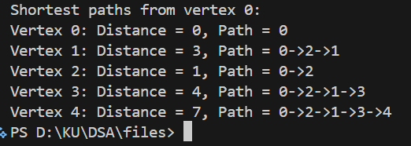

# Dijkstra's Shortest Path Algorithm: Technical Documentation

## 1. Introduction

**Purpose**: Find shortest path from source to all vertices in weighted undirected graphs using greedy approach.

**Problem Statement**: Navigate minimum-cost routes; weighted edges require different algorithm than unweighted BFS.

**Objectives**: Implement Dijkstra algorithm; compute single-source shortest paths; track predecessors for path reconstruction.

## 2. System Overview

**Principle**: Greedy selection of minimum-distance unvisited vertex; relaxation updates neighbor distances.

**Workflow**: Initialize distances → Repeatedly pick minimum unvisited → Update neighbor distances → Track predecessors.

## 3. Data Structures

```c
typedef struct {
    int numVertices;
    int adjMatrix[MAX_VERTICES][MAX_VERTICES];  // INF for no edge
} WeightedGraph;
```

**Algorithm State**: dist[] (shortest distances), visited[] (processed status), parent[] (path reconstruction).

## 4. Algorithm Steps

1. Initialize: dist[source]=0, all others=INF, visited[]=false
2. Repeat until all visited:
   - Select unvisited vertex u with minimum dist[u]
   - Mark u as visited
   - For each unvisited neighbor v:
     - If dist[u]+weight(u,v) < dist[v], update dist[v] and parent[v]
3. Result: dist[] contains shortest distances; parent[] enables path reconstruction

## 5. Complexity Analysis

**Time**: $O(V^2)$ with array; $O((V+E)\log V)$ with priority queue
**Space**: $O(V)$ for state arrays

## 6. Functions

**createWeightedGraph()**: Initialize adjacency matrix with INF

**addWeightedEdge()**: Add weighted edge (undirected)

**findMinDistance()**: Find unvisited vertex with minimum distance

**dijkstra()**: Core algorithm computing shortest paths

## 7. Implementation Details

**Libraries**: stdio.h, stdlib.h, limits.h, stdbool.h

**Platform**: C standard; all systems; max 10 vertices

## 8. Testing and Results

Correctly computes shortest paths from source; all reachable vertices have optimal distances.

## 9. Limitations

Fixed maximum vertices; dense graphs inefficient; array-based minimum search $O(V^2)$; no negative-weight edges.

## 10. Conclusion

Successfully implements classical Dijkstra for shortest paths. Greedy approach optimal for non-negative weights. Future: priority queue optimization, negative-weight handling (Bellman-Ford), dynamic programming.


